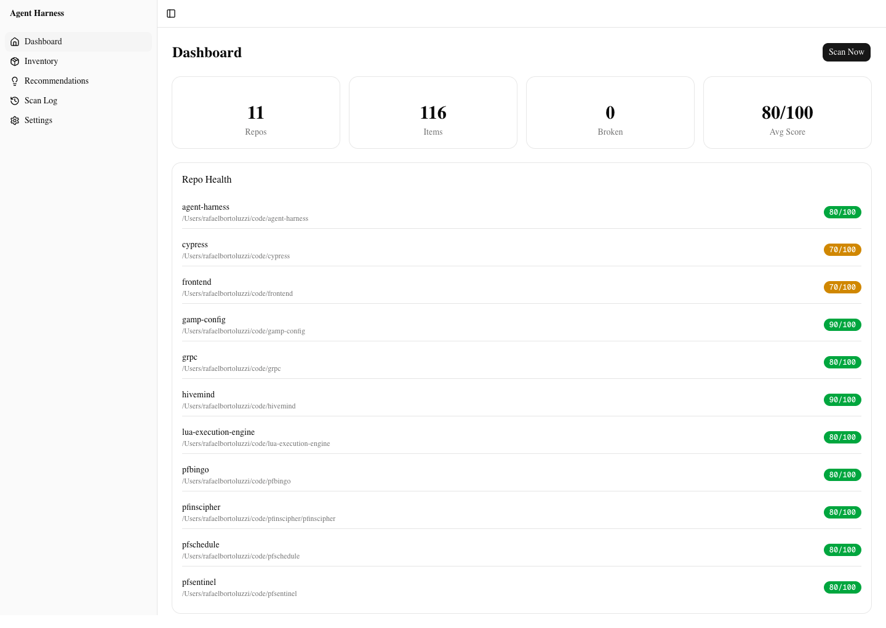

# Agent Harness

Local-first tool that inventories, validates, and surfaces health of AI agent environments (skills, agents, hooks, MCPs, instructions, plugins) across Claude Code, Codex, and other runtimes.

## Quick Start

```sh
git clone https://github.com/<you>/agent-harness
cd agent-harness
pnpm install
pnpm cli scan
pnpm dev   # then open http://127.0.0.1:3000
```

Zero config needed. Add discovery roots via Settings or `~/.agent-harness/config.json`.

Current local smoke scan:

- 11 repos discovered from `/Users/rafaelbortoluzzi/code`
- 116 registry items
- 0 broken items
- Caveman detected from `~/.claude/plugins/marketplaces/caveman`



## CLI

```sh
pnpm cli scan [--json]            # scan + persist registry
pnpm cli list --runtime claude    # list items, optionally filtered
pnpm cli doctor                   # repo health summary; exit 1 if broken
pnpm cli export <path>            # backup registry.db
pnpm cli snooze <item-id> [--days N] [--reason TEXT]
pnpm cli judge [--runtime X] [--limit N]      # LLM quality scores
pnpm cli analyze [--repo PATH]                # LLM gap recommendations
pnpm cli watch                                # daemon: auto-scan on change
```

CLI is the source of truth for CI integration. UI is a view layer.

## UI

- **Dashboard** — health score per repo, broken items, "Scan Now" + "Judge with LLM"
- **Header** — watch daemon status indicator for `pnpm cli watch`
- **Inventory** — filterable + paginated table with debounced search; row → side panel with quality score, snooze controls, and "Edit with Claude" stream + apply
- **Recommendations** — LLM gap analyst output per repo, "Analyze All Repos" button, and one-click skill draft creation
- **Scan Log** — chronological scan history with duration, status, and per-scan new/removed/changed item counts
- **Settings** — discovery roots, explicit repos, depth, LLM provider status

## Supported Runtimes

| Runtime | Scans |
|---------|-------|
| Claude Code | `~/.claude/skills/<name>/SKILL.md`, agents, rules, commands, plugins, hooks + MCPs from `settings.json` / `settings.local.json`, repo `.claude/`, `CLAUDE.md`, `.mcp.json` |
| Codex | `~/.codex/config.toml` (mcp_servers), `hooks.json`, `AGENTS.md`, `prompts/`, repo `AGENTS.md` |

Add your own — see [CONTRIBUTING.md](CONTRIBUTING.md).

## Security

- Next.js dev/start scripts bind to `127.0.0.1` only — never `0.0.0.0`
- `ANTHROPIC_API_KEY` is read server-side only when using the API provider; never exposed to the client
- SQLite registry stored at `~/.agent-harness/registry.db` with WAL + foreign keys

## Data

User data lives at `~/.agent-harness/` (override with `AGENT_HARNESS_DIR`):

- `config.json` — discovery roots, depth, health weights
- `registry.db` — items, scans, repos, snoozes

## LLM Features (Phase 2)

All optional. Select a provider with `AGENT_HARNESS_LLM_PROVIDER`:

- `claude-code-cli` — uses local `claude` CLI login for judge and gap analysis.
- `codex-cli` — uses local `codex` CLI login for judge and gap analysis.
- `anthropic-api` — default; uses `ANTHROPIC_API_KEY`.

- **Judge** — `pnpm cli judge` scores each skill/agent/rule/command 0-10 with one-sentence rationale. Dashboard exposes a Judge button.
- **Gap analyst** — `pnpm cli analyze` recommends up to 5 missing skills/agents per repo based on the existing inventory. Output rendered at `/recommendations`.
- **Skill editor** — In the inventory side panel, "Edit with Claude" streams an edited file body via NDJSON. Apply writes atomically (tmp + rename). This still requires `ANTHROPIC_API_KEY`.
- **Watch** — `pnpm cli watch` runs a chokidar daemon over `~/.claude/`, `~/.codex/`, and `<repo>/.claude/`, debounced to 1.5s, triggering a full rescan on change. The header polls local watch status and shows on/stale/off.

## Roadmap

See [ROADMAP.md](ROADMAP.md) for the current status ledger, known debt, and
next development slice.

Phase 3 ideas:

- Remote registry for team-wide inventory
- Adapters for additional runtimes (Cursor, Aider, Continue)
